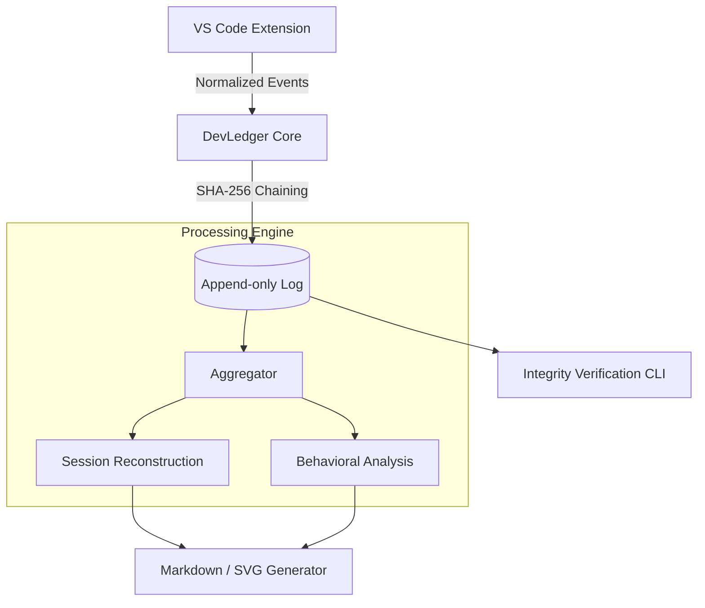

# DevLedger

[](https://github.com/whaiman/dev-ledger)
[](https://github.com/whaiman/dev-ledger)
[](LICENSE)

**DevLedger** is a high-performance, local-first developer activity ledger designed for transparency, privacy, and data integrity. It captures granular IDE interactions and reconstructs them into verifiable coding sessions using a cryptographic hash chain.

---

## Key Features

- **Immutable Event Log**: All activity is stored in an append-only JSONL format, protected by a SHA-256 hash chain (blockchain-like integrity).
- **Intelligent Session Reconstruction**: Beyond raw events, DevLedger implements a heartbeat-based timeline model to accurately calculate active coding time and detect idle periods.
- **Behavioral Analysis Layer**: Detects non-human editing patterns (e.g., large automated pastes) through statistical analysis of edit entropy and timing.
- **Zero External Dependencies**: No APIs, no telemetry, no cloud. Your data never leaves your machine.
- **Automated Reporting**: Generates comprehensive Markdown reports and SVG visualizations for project documentation.

---

## System Architecture



---

## Integrity Model

DevLedger ensures data validity using a sequential cryptographic link. Each event $e_i$ is bound to the state of the entire previous history through its hash $h_i$:

$$h_i = \text{SHA256}(payload_i + h_{i-1})$$

This model prevents:

1. **Silent Tampering**: Any modification to a historical event invalidates all subsequent hashes.
2. **Backdating**: Events are timestamped and chained in real-time.
3. **Data Loss**: Gaps in the chain are immediately detectable during verification.

---

## Setup & Installation

### 1. Requirements

- Node.js v18+
- pnpm

### 2. Build & Link

```bash
pnpm install
pnpm build

# Install CLI globally
cd packages/cli && pnpm link --global
```

### 3. Install VS Code Extension

1. Navigate to `packages/vscode-extension`.
2. Build: `pnpm build`.
3. Package: `npx vsce package --no-dependencies --allow-missing-repository --allow-star-activation`.
4. Install the resulting `.vsix` via the Extensions view in VS Code.

---

## CLI Usage

| Command                      | Description                                                 |
| :--------------------------- | :---------------------------------------------------------- |
| `devledger stats`            | Display raw aggregated statistics in JSON format.           |
| `devledger report`           | Generate a human-readable Markdown report.                  |
| `devledger inject -f <file>` | Update a specific file (e.g. README) between tags.          |
| `devledger verify`           | Validate the integrity of the entire hash chain.            |
| `devledger reset <project>`  | Insert a logical checkpoint to restart statistics tracking. |

---

## Security & Privacy

DevLedger is designed as a trustless auditing tool. While it runs locally, the integrity hash allows for external verification of your activity logs. It is recommended to include the **Integrity Hash** in your project commits to provide a permanent, verifiable record of development effort.

---

## License

Distributed under the MIT License. See `LICENSE` for more information.
